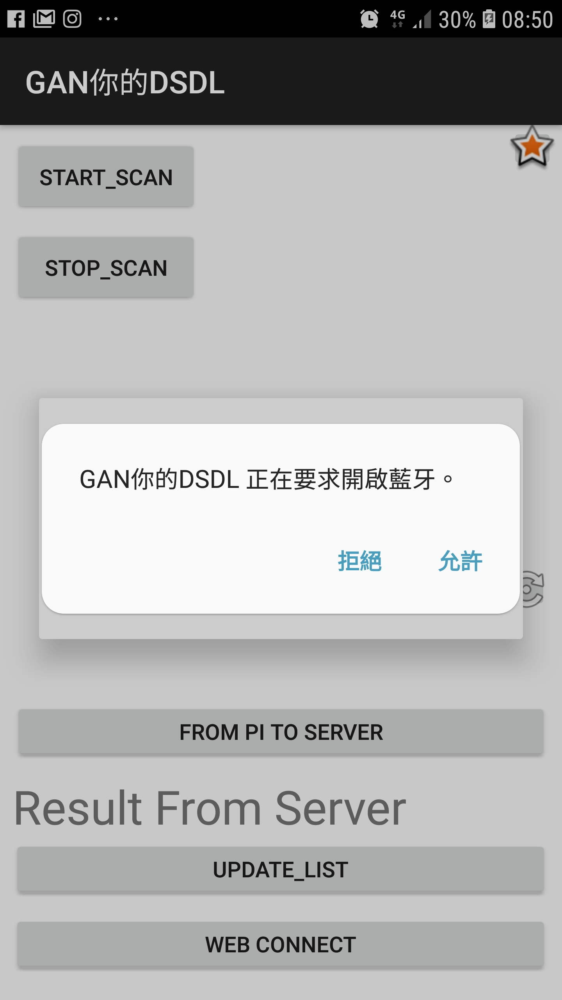
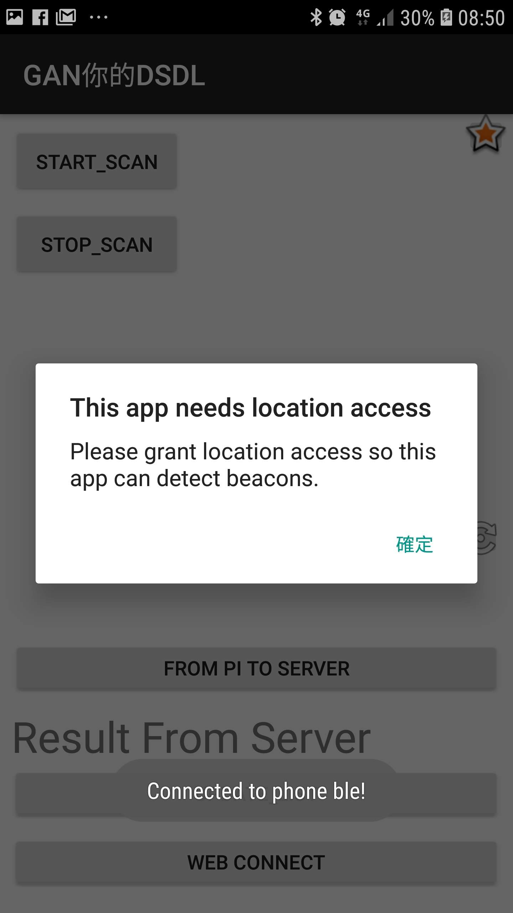
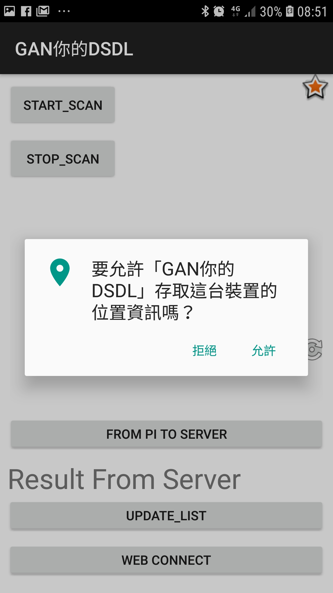
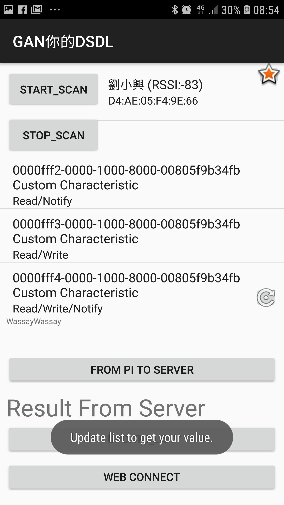
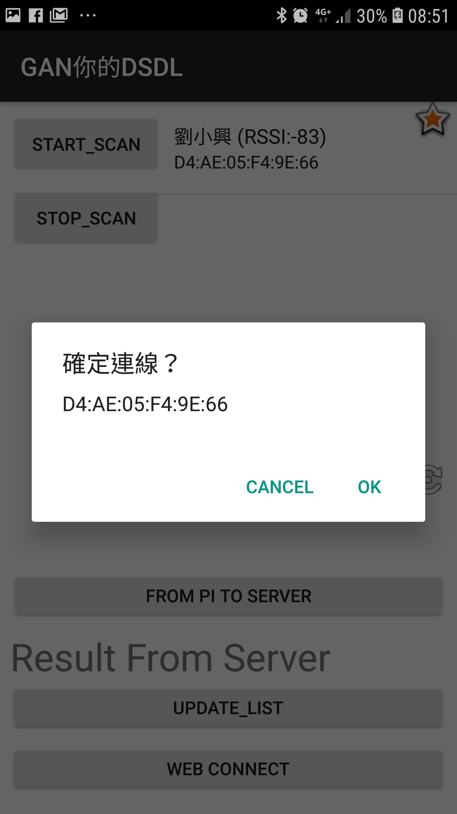

Android Client Application
===

> Works in Android: b05902127 劉俊緯

## Test Machine

* Samsung Galaxy S7/S8, Android 7.0/8.0 (My phone).
* OPPO Z11, Android 8.0 (Thanks to piepie b05902031).
* ASUS Z01 (Thanks to 麻麻 b05902013).
* HTC U11 (Thanks to 老司機 b05902109).
* Mostly, this application can be applied without error.

## Prior Statements

* All the app is build from scratch in our teams.
* No extra API we used. That is, all methods we call is official API.
* Thanks to all the team members.
* This app is not only can connect with the rpi we have but also can applied in all the machines that have funtionality of BLE advertiser.

## Workflow

### Request of Bluetooth

* Starting the app, you will get a message that requesting of the bluetooth permission.

### Request of Location

* In version above/equals android 5.0, there's an extra request of permission about coarse location.  
|request 1| request 2|
|-|-|
|||

### Main page

* The picture below shows the functions of this app, and I'll tell you what steps you ought do to achieve the bonus spec.

### Start Scan / Stop Scan

* First of all, you need to press the button "START SCAN" in rightabove of this app. This step is to build a connection between your android phone and the target device.
* If your phone discover the device, app will show the details of **device's name, RSSI, and bluetooth MAC address**, for fear that you cannot remember your phone/rpi3's address.
* If you don't want to scan anymore, press STOP_SCAN ,and there's no update in list anymore.
* (Implementation details)  This scan is done by ble API: `BluetoothLeScanner`.
  * Callback method's `onScanResult` will appear same device multiple times. Therefore, I use `HashMap` to keep the list, and use a listview to show the results. 

|pressing the "START_SCAN", you'll get the message "掃描之前，請先膜拜麻麻三次<(_ _)>"|if find a device, the rightabove corner will show the discovered device.|
|-|-|
|||

### Build Connection and Get Characterestic Info

* (Tips) the listview is scroll-able. You can scroll it to find the device you want to build connection.

|Press the device you want to connect, and it'll show a message that notify you, letting you check again.|If the connection is established, Press "UPDATE_LIST" in the below to get the characteristics from this advertiser.|
|-|-|
|||