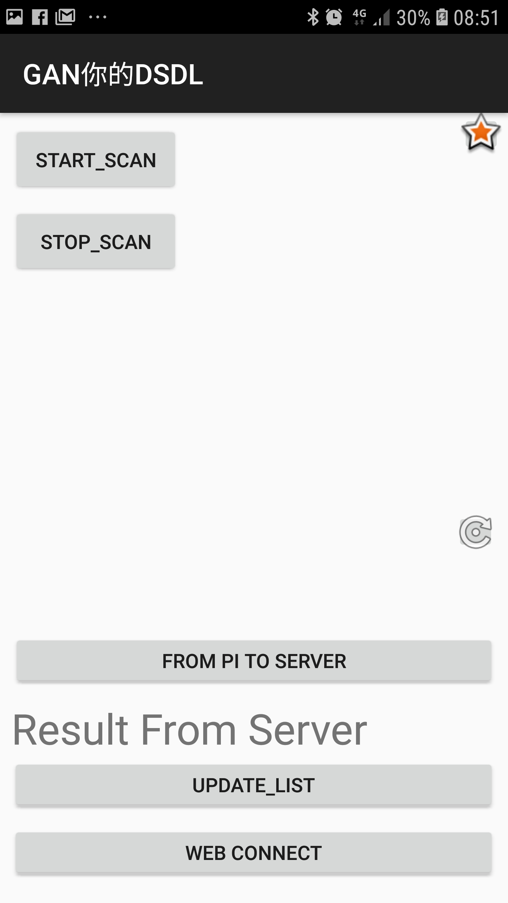

Android Client Application
===

> Works in Android: b05902127 劉俊緯

## Test Machine

* Samsung Galaxy S7/S8, Android 7.0/8.0 (My phone).
* OPPO Z11, Android 8.0 (Thanks to piepie b05902031).
* ASUS Z01 (Thanks to 麻麻 b05902013).
* HTC U11 (Thanks to 老司機 b05902109).
* Mostly, this application can be applied without error.

## Prior Statements

* All the app is build from scratch in our teams.
* No extra API we used. That is, all methods we call is official API.
* Thanks to all the team members.
* This app is not only can connect with the rpi we have but also can applied in all the machines that have funtionality of BLE advertiser.

## Workflow

### Request of Bluetooth

* Starting the app, you will get a message that requesting of the bluetooth permission.

### Request of Location

* In version above/equals android 5.0, there's an extra request of permission about coarse location.  

|request 1| request 2|
|-|-|
|||

### Main page

* The picture below shows the functions of this app, and I'll tell you what steps you ought do to achieve the bonus spec.

### Start Scan / Stop Scan

* First of all, you need to press the button "START SCAN" in rightabove of this app. This step is to build a connection between your android phone and the target device.
* If your phone discover the device, app will show the details of **device's name, RSSI, and bluetooth MAC address**, for fear that you cannot remember your phone/rpi3's address.
* If you don't want to scan anymore, press STOP_SCAN ,and there's no update in list anymore.
* (Implementation details)  This scan is done by ble API: `BluetoothLeScanner`.
  * Callback method's `onScanResult` will appear same device multiple times. Therefore, I use `HashMap` to keep the list, and use a listview to show the results. 

| pressing the "START_SCAN", you'll get the message "掃描之前，請先膜拜麻麻三次<(_ _)>" | if find a device, the rightabove corner will show the discovered device. |
| ------------------------------------------------------------ | ------------------------------------------------------------ |
|                             |                                   |

### Build Connection and Get Characterestic Info

* (Tips) the listview is scroll-able. You can scroll it to find the device you want to build connection.
* Press the device you want to connect, and it'll show a message that notify you, letting you check again.
* If the connection is established, Press "UPDATE_LIST" in the below to get the characteristics from this advertiser.
* For each characteristic, it'll show the **UUID for this characteristic , the classification in this characteristic formulated by bluetooth regulations, the priority of read/write/notify**
* If you try to build another connection, the new characteristic will show the bottom of this listview.
* (Implementation Details) Why we use a button "UPDATE_LIST" ? Because "read characteristic" method is asynchronous, so the callback function will be called once it finished. That is, this is another "thread-liking" to do this task, but, the UI thread (Android UI Thread) is not permitted to let a not-main thread to change the view.
  * In this case, most of apps are use handler to accomplish this task. And we choose to that main-thread trigger the updation of view.   

|Press the device you want to connect, and it'll show a message that notify you, letting you check again.|If the connection is established, Press "UPDATE_LIST" in the below to get the characteristics from this advertiser.|
|-|-|
|||

### Read and Write a  Characteristic 

* (Tips) The characteristic listview is scroll-able.
* Choose the characteristic that you interested in, and the message "Read or Write?" will show.
  * The default write is "get wallet address", because the rpi server is designed when getting a string "get wallet address", it'll write wallet address in this characteristic.
* **Read Mode**: Just press read, and the result will show under the characteristic listview.
* **Write Mode**: Overwrite the edittext and write anything you want to transmit to the advertiser.
* **Paste Mode**: A special function, it'll pass the first 16 bytes in the text column "Result From Server" to the advertiser. Once you press it, the first 16 bytes show in the column will disappear.

|Read or Write? |Read result is under the characteristic list, as you see, the read result is "WassayWassay".|
|-|-|
|||

### Send Message to Server
* Both Write mode and Paste mode will request you type the port that the server listened.
* Now, the IP Address is fixed to 140.112.90.167, please do not hurt it.
* Confirmed, the server will get you the message, and server shall return a message.
* The message that server returned will overwrite the column "Result From Server". 

|Write/Paste Mode|Web Connection|
|-|-|
|||

### Some feature button

* You may notice there's some buttons in the app:
  * Clean button (located at the right-below corner of characteristic's listview)
    * It'll clean the message below (that is, the message accumulated from advertiser), lest you may do something wrong and have no choice to restart all the procedure.
  * Star Button (located at the right-above corner of whole app)
    * OUR SPECIAL FEATURE, TXID to IMAGE by GAN.
    * After the transaction made by the server, it'll return txid to the client (Your phone) , and the star button can show the image that generate from gan using the last txid.
    * The image is stored in CSIE WORKSTATION once server generate the image, don't hurt it. 

|Clean Button|Star Button|
|-|-|
|||

